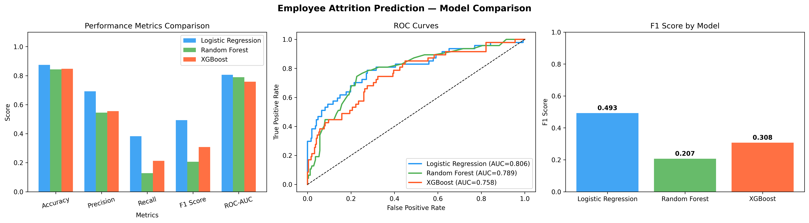
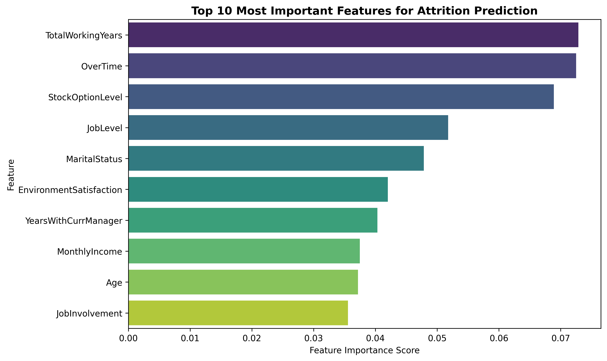

# Employee Attrition Prediction — ML Model Comparison 📊

> **Comparative analysis of Logistic Regression, Random Forest, 
> and XGBoost for employee attrition prediction using the 
> IBM HR Analytics dataset**

[](https://python.org)
[](LICENSE)
[](https://ssrn.com)

---

## 📌 Overview

This repository contains the complete code and analysis for the 
research paper:

**"Predicting Employee Attrition Using Machine Learning: A 
Comparative Analysis of Classification Models for Human 
Resource Analytics"**

> Submitted to SSRN and ICBDAA 2026 International Conference, 
> Singapore, November 27-29, 2026

Employee attrition costs organizations between 50% and 200% of 
an employee's annual salary. This study systematically compares 
three machine learning models to identify the most effective 
approach for enterprise HR attrition prediction.

---

## 🔑 Key Finding

**Logistic Regression outperformed Random Forest and XGBoost** 
across all five evaluation metrics — consistent with prior 
findings in customer churn prediction, providing cross-domain 
evidence that interpretable models may outperform complex 
ensemble methods on structured business datasets.

---

## 📊 Results

| Model | Accuracy | Precision | Recall | F1 Score | ROC-AUC |
|---|---|---|---|---|---|
| **Logistic Regression** | **87.41%** | **0.6923** | **0.3830** | **0.4932** | **0.8057** |
| Random Forest | 84.35% | 0.5455 | 0.1277 | 0.2069 | 0.7890 |
| XGBoost | 84.69% | 0.5556 | 0.2128 | 0.3077 | 0.7580 |

---

## 🔍 Top Attrition Predictors

| Rank | Feature | Importance |
|---|---|---|
| 1 | TotalWorkingYears | 0.0729 |
| 2 | OverTime | 0.0725 |
| 3 | StockOptionLevel | 0.0689 |
| 4 | JobLevel | 0.0518 |
| 5 | MaritalStatus | 0.0478 |

---

## 📁 Repository Structure

employee-attrition-prediction-ml/
├── attrition_prediction.ipynb        # Full analysis notebook
├── attrition_model_comparison.png    # Model performance charts
├── attrition_feature_importance.png  # Feature importance analysis
└── README.md

---

## 🗂️ Dataset

**IBM HR Analytics Employee Attrition Dataset**
- 1,470 employee records
- 31 features
- Binary target: attrition yes/no
- Available on Kaggle: kaggle.com/datasets/pavansubhasht/ibm-hr-analytics-attrition-dataset

---

## 🛠️ How To Run

1. Open `attrition_prediction.ipynb` in Google Colab or Jupyter
2. Install dependencies:
```python
!pip install xgboost
```
3. Run all cells in order
4. Results and charts generate automatically

---

## 🔗 Related Research

This paper is part of a research series on ML model comparison 
for business analytics:

- **Paper 1:** Customer Churn Prediction in Telecommunications  
  [github.com/fnuVishakha/customer-churn-prediction-ml](https://github.com/fnuVishakha/customer-churn-prediction-ml)  
  [SSRN](https://papers.ssrn.com/sol3/papers.cfm?abstract_id=6819479)

- **Paper 2:** Employee Attrition Prediction (this repository)

---

## 📈 Visualizations

### Model Performance Comparison


### Feature Importance (XGBoost)


---

## 👩‍💻 Author

**Vishakha FNU**
MBA Candidate, Business Analytics | BS, Computer Engineering
California State University, Fullerton

[](https://linkedin.com/in/fnuVishakha)
[](https://github.com/fnuVishakha)

---

## 📄 License

MIT License — free to use with attribution

---

*If this research was helpful please give it a ⭐ — 
it supports ongoing research in business analytics!*
